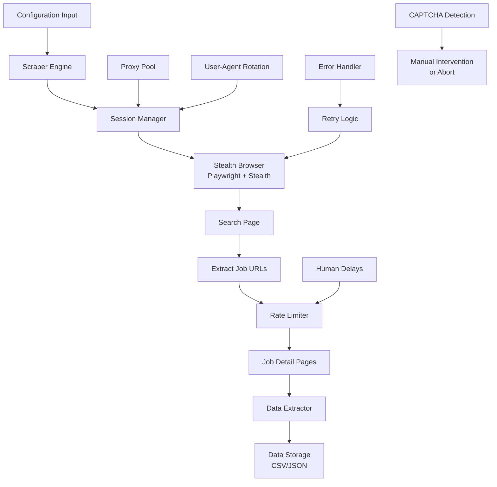

# Glassdoor Job Scraper - Technical Plan

## Overview
A standalone, robust Glassdoor job scraper capable of handling large volumes while evading anti-bot detection through headless browser automation with stealth techniques, proxy rotation, and human-like behavior patterns.

## Architecture



## Anti-Bot Strategy

### 1. Stealth Browser (Primary Defense)
- **Playwright** with **playwright-stealth** plugin
- Real browser fingerprinting (Chrome/Firefox)
- WebGL, Canvas, and Font fingerprint randomization
- Disabled automation flags (`navigator.webdriver = false`)

### 2. Proxy Rotation
- Support for free proxy lists (proxy-list.download, free-proxy-list.net)
- Optional: User-provided proxy list
- Session-based proxy assignment
- Automatic proxy health checking

### 3. Human-Like Behavior
- Random delays between actions (2-8 seconds)
- Mouse movement simulation
- Scroll behavior with variable speed
- Random viewport sizing
- Session persistence (cookies, localStorage)

### 4. Request Patterns
- Randomized User-Agent strings
- Accept-Language headers rotation
- Referrer headers from Glassdoor pages
- Request timing that mimics human browsing

## Data Points to Extract

### From Search Results:
- Job Title
- Company Name
- Location
- Salary Range (if visible)
- Job URL
- Posting Date
- Company Rating
- Company Size (if available)

### From Job Detail Page:
- Full Job Description
- Job Requirements/Qualifications
- Benefits
- Employment Type (Full-time, Contract, etc.)
- Industry
- Company Description
- Interview Difficulty (if available)

## Project Structure

```
glassdoor_scraper/
├── config/
│   └── settings.py          # Configuration defaults
├── core/
│   ├── __init__.py
│   ├── browser.py           # Stealth browser manager
│   ├── scraper.py           # Main scraper logic
│   ├── extractor.py         # Data extraction functions
│   └── rate_limiter.py      # Delay and throttling
├── utils/
│   ├── __init__.py
│   ├── proxy_manager.py     # Proxy rotation
│   ├── user_agents.py       # UA rotation
│   └── helpers.py           # Utility functions
├── storage/
│   ├── __init__.py
│   └── exporters.py         # CSV/JSON export
├── exceptions/
│   └── custom_exceptions.py # Custom error classes
├── main.py                  # CLI entry point
├── requirements.txt
└── README.md
```

## Rate Limiting Strategy

| Action | Min Delay | Max Delay | Notes |
|--------|-----------|-----------|-------|
| Initial page load | 3s | 5s | Simulate reading |
| Search submission | 2s | 4s | Form interaction |
| Between job clicks | 4s | 8s | Human reading time |
| Pagination | 3s | 6s | Page transition |
| After CAPTCHA | 10s | 15s | Extra caution |

## Error Handling

### Retry Logic:
- Network errors: 3 retries with exponential backoff
- Timeout errors: 2 retries with longer delays
- HTTP 429 (Rate Limited): Wait 60s, rotate proxy, retry
- HTTP 403 (Blocked): Rotate proxy immediately
- CAPTCHA detected: Pause for manual solve or abort

### Detection Patterns:
- URL contains "captcha" or "challenge"
- Page title contains "verify" or "robot"
- Unexpected page structure
- Missing expected elements

## Dependencies

```
playwright>=1.40.0
playwright-stealth>=1.0.0
requests>=2.31.0
beautifulsoup4>=4.12.0
lxml>=4.9.0
fake-useragent>=1.4.0
python-dotenv>=1.0.0
```

## Usage Example

```python
from glassdoor_scraper import GlassdoorScraper

scraper = GlassdoorScraper(
    headless=False,  # Set True for production
    use_proxies=True,
    max_jobs=100,
    delay_range=(3, 7)
)

jobs = scraper.search(
    keyword="Software Engineer",
    location="Toronto, ON",
    days_ago=7,
    job_type="fulltime"
)

scraper.export_to_csv(jobs, "jobs.csv")
scraper.close()
```

## Limitations & Warnings

1. **Legal**: Scraping may violate Glassdoor's Terms of Service
2. **Detection**: Even with stealth, large-scale scraping may trigger blocks
3. **Data Accuracy**: Selectors may break if Glassdoor updates their UI
4. **Rate Limits**: Aggressive scraping will result in IP bans
5. **CAPTCHA**: Some situations require manual intervention

## Free Proxy Sources

1. **proxy-list.download** - HTTP/HTTPS proxies
2. **free-proxy-list.net** - Updated hourly
3. **geonode.com** - Free tier available
4. **User-provided**: Support for custom proxy lists

## Next Steps

1. Switch to Code mode to implement the scraper
2. Start with browser setup and stealth configuration
3. Implement search functionality
4. Add data extraction
5. Integrate proxy rotation
6. Add export functionality
7. Test and refine
